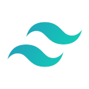

# My Personal Website

## Project Summary

My previous personal website was dated 2016 and I built in a couple of nights while I was trying to land my first job in tech
Since then, I always wanted to review it from scratch. I started multiple times, but I always ended up giving up after a few days because life got in the way. After 6 years, I found the right technology (**_svelte_**) that made the effort really enjoyable!

The website has the following sections:

As per today:

- Home page
- About page
- Blog page (aggregated)
- Tech blog
- Personal blog

Coming soon:

- Career page

### See it in action

[Homepage](www.antoniorossi.net)

## Technologies Used

- **Svelte**
- **Mdsvex**
- **Tailwind CSS**
- **Vite**

---

During the development process I used also the following tools:

- **Visual Studio Code**: GUI
- **Figma**: UI design tool

## How to run the application locally

- Clone the repository
- Install the required packages with `npm install`
- Build with the command `npm run build` or run it in dev mode with `npm run dev -- --open`
